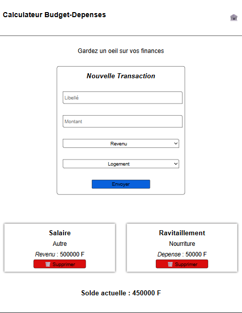

# calculateur-budget-depenses 🏦

Gardez un oeil sur vos opérations financieres

Un systeme de signalisation et suivi de vos operations financière avec calcul de solde

## Fonctionnalités

- Déclarer un mouvement d'argent
- Consulter les operations effectuer
- Voir son solde

## Démo

[Voir la demo en ligne](https://hissene-credo.github.io/calculateur-budget-depenses/)

## Stack Technique

HTML/ CSS/ JAVASCRIPT ( Vanilla, sans fremework )

## Lancer le projet en local

1. Cloner le repos : `git clone https://hissene-credo.github.io/calculateur-budget-depenses.git`
2. Ouvrir index.html sur un navigateur

## Roadmap

- [ ] Persistance de données
- [ ] Refonte de l'interface UI/UX
- [ ] Fonctionnalités ajoutées

